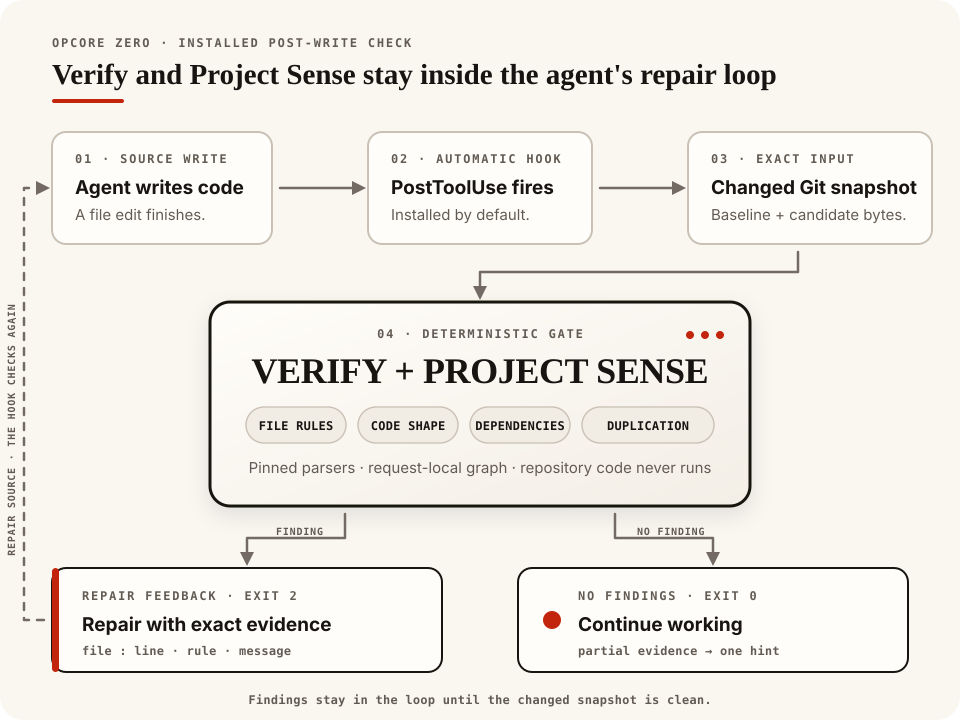
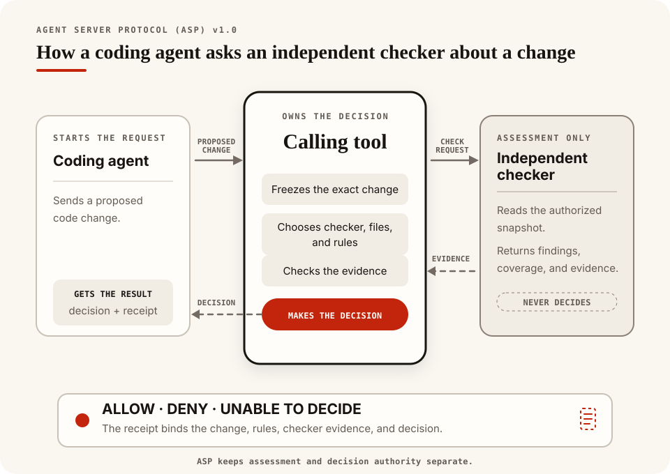

# Opcore

Opcore gives coding agents specific feedback while they edit source. Its installed hook checks the current Git changes and returns the file, location, rule, and evidence when something needs repair.

> [!IMPORTANT]
> **Opcore 0.3.0 is a full rewrite.** We narrowed the old graph, search, and editing toolkit to focus on dependable verification during agent work:
>
> - One Rust engine reuses parsed source facts, removing graph databases and repeated snapshot builds from routine checks.
> - Feedback follows completed edits, including supported shell and MCP calls, so coverage depends less on tool-specific patch formats.
> - Rules use explicit evidence and report coverage gaps; documentation ownership no longer depends on filename mentions.
> - Automatic checks never execute project code. Compiler checks are opt-in for pre-commit and CI.
>
> The old `graph`, `inspect`, and `edit` commands are retired. Install `@the-open-engine-company/opcore` and follow the new setup instructions.



[Open the phone-sized hook diagram](docs/assets/opcore-hook-loop-mobile.svg)

**Verify**, available as `opcore check`, checks syntax and source hygiene for JavaScript and TypeScript, Python, Rust, Go, HCL-based infrastructure code, Shell, and Protocol Buffers. JavaScript, TypeScript, Python, Rust, and Go also receive callable size and complexity checks.

**Project Sense** compares repository relationships with the Git baseline. It reports introduced runtime cycles, exact duplication, growing interface violations, and documentation obligations. Unchanged or reduced baseline debt doesn't block.

The default checks read a captured Git view and verify that it stayed unchanged. They don't execute repository code or alter source and Git state. The installed post-edit hook sends Verify and Sense findings back to the agent for repair. Commit hooks and CI provide the final checks.

## Get started

Upgrading from `opcore` 0.2.x or an Opcore Zero development install? Follow the [migration instructions](docs/getting-started.md#upgrade-from-an-earlier-installation) before installing.

The npm release supports Linux x86-64 with glibc 2.39 or newer and Apple silicon macOS. You'll need Node.js 18 or newer, npm, Bash, and Git. Agent integration requires Codex or Claude.

```sh
npm install -g --foreground-scripts @the-open-engine-company/opcore
opcore --version
```

From a Git project, run:

```sh
opcore doctor --repo .
opcore check --repo . --all
```

The installer sets up every detected agent at user scope, so its hooks apply across that agent's Git projects. After a Codex install, restart Codex, open `/hooks`, review the command, and trust it. Doctor checks installed configuration; follow the [activation smoke test](docs/getting-started.md#confirm-hook-activation) to verify automatic execution.

If npm skipped lifecycle scripts, run `opcore setup`. For the CLI without agent integration, use `opcore setup --no-hooks`; [project-local and CI setup](docs/getting-started.md#project-local-and-ci-installation) also works without an agent installation.

See [Getting started](docs/getting-started.md) for source and archive installs, agent selection, prerequisites, and cleanup. Windows, Linux ARM64, and Intel macOS have no published binaries.

## Workflows

```sh
opcore run post-edit                         # current changes against HEAD
opcore run pre-commit                        # full staged Verify and introduced Sense
opcore run ci --base <base-commit>            # full committed Verify and introduced Sense
```

Add the pre-commit workflow to your Git hook and require the CI workflow alongside existing tests and linters. Configure the applicable native providers for compiler or type-checker coverage; those runs also require explicit host authorization. The [setup guide](docs/getting-started.md#add-pre-commit-and-ci-checks) has recipes.

One root `.opcore.json` holds shared settings and workflow overrides. Pre-commit can use stricter thresholds or fewer exclusions than post-edit; monorepos can select different native project roots. See [Configuration](docs/configuration.md).

Use `check` or `sense` to run an individual evaluator. Plain `check` reports `Nothing checked` on a clean worktree; `check --all` checks the current project even when nothing changed. A full check with no selected supported source reports unsupported coverage.

| Result | Next step |
| --- | --- |
| `Clean` or `allow` | The selected required checks completed with no findings. |
| `Findings` or `deny` | Read the evidence, repair the change, and rerun the same command. |
| `Not checked` | No source changes required checking; use `check --all` for a project check. |
| `Partial` | Review the missing Sense coverage. Use `--allow-partial` only if you accept those gaps. |
| `Unsupported` | Choose supported source or a provider that applies to the project. |
| `Incomplete` or `indeterminate` | Resolve the reported setup, capture, or evaluation failure and retry. |

`--advisory` makes findings report-only; missing coverage still blocks. Add `--json` for structured evidence. The [getting-started guide](docs/getting-started.md#read-the-result) explains exit statuses and partial-coverage options.

The [examples](docs/examples.md) show findings in every supported language family.

## Providers

| Provider | Checks |
| --- | --- |
| Fast | Built-in syntax, hygiene, and code metrics; the default CLI and hook path. |
| Rust-native | Cargo Check against the selected workspace or package. |
| Node-native | Project-local TypeScript checking with an npm lockfile. |
| Python-native | Host Pyright or mypy using the selected Python environment. |

Native checks are opt-in. They may execute repository-controlled build scripts, wrappers, or checker plugins with the current account's access to host files and the network. Their temporary copy doesn't isolate that execution; automatic hooks always use the default checks. See [Provider setup and usage](docs/providers.md) before selecting native profiles.

## Agent Server Protocol

Opcore includes the complete Agent Server Protocol (ASP) v1.0 definition and four check providers. A calling tool supplies exact file contents and grants read access. Each provider returns findings, coverage, and evidence; the calling tool owns the decision and any ASP receipt.



[Open the phone-sized ASP diagram](docs/assets/asp-overview-mobile.svg)

Opcore's bundled local runner reports `allow`, `deny`, or `indeterminate` for local use. Its result has advisory assurance and doesn't issue an ASP receipt. Read the [protocol definition](asp/README.md) for integration contracts.

## Documentation and help

Read the [published documentation](https://the-open-engine.github.io/opcore/), including the [CLI reference](https://the-open-engine.github.io/opcore/cli.html), [public Rust API](https://the-open-engine.github.io/opcore/api/opcore/api/index.html), and ASP specification. In a source checkout, generate the same site from the Rust definitions:

```sh
./scripts/build-docs.sh
```

Open `target/site/index.html` in a browser. CI checks the generated site on every pull request and publishes the passing `main` build to GitHub Pages. Running the local build only writes `target/site/`.

Report reproducible problems in [GitHub Issues](https://github.com/the-open-engine/opcore/issues). [Contributing](CONTRIBUTING.md) explains useful report details and the development checks.

Before removing an npm installation, clean up its agent integrations:

```sh
opcore uninstall
npm uninstall -g @the-open-engine-company/opcore
```

[Update and removal instructions](docs/getting-started.md#update-or-remove) cover source installs and recovery after an interrupted setup.
