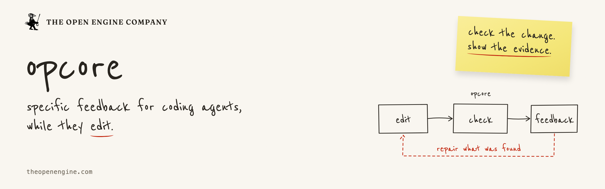

<picture>
  <source media="(prefers-color-scheme: dark)" srcset="docs/brand/opcore-hero-dark.png">
  
</picture>

# Opcore

<a href="https://github.com/the-open-engine/opcore/actions/workflows/opcore.yml?query=branch%3Amain+event%3Apush"></a>
<a href="https://discord.gg/fZyzf2Cut9"><picture><source media="(prefers-color-scheme: dark)" srcset="docs/brand/social/discord-cta-dark.png"></picture></a>

Opcore gives coding agents specific feedback while they edit source. Its installed hook checks the current Git changes and returns the file, location, rule, and evidence when something needs repair.

The automatic checks never run your project's code. Compiler and type-checker checks are opt-in for pre-commit and CI.

Opcore pairs with [Zeroshot](https://github.com/the-open-engine/zeroshot): Opcore checks each edit while an agent writes code, and Zeroshot has independent agents review the whole change before it lands.

Questions or feedback? Join [The Open Engine community on Discord](https://discord.gg/fZyzf2Cut9).

> [!IMPORTANT]
> **Opcore 0.3.0 is a full rewrite.** The `graph`, `inspect`, and `edit` commands are gone. Upgrading from 0.2.x? Follow the [migration instructions](docs/getting-started.md#upgrade-from-an-earlier-installation).

## When to use it

Opcore fits when:

- Codex or Claude Code edits your repository and you want problems caught during the session, with the file, location, rule, and evidence the agent needs to fix them;
- you want the same checks as a pre-commit hook and a CI gate;
- your code is JavaScript or TypeScript, Python, Rust, Go, HCL-based infrastructure, Shell, or Protocol Buffers.

It is not:

- a test runner, or a replacement for your existing linters and tests. Run it alongside them;
- a code search, navigation, or refactoring tool;
- available as published binaries for Windows, Linux ARM64, or Intel macOS yet.

## Examples

<details>
<summary><strong>See what Opcore catches</strong></summary>

Expand an example below to see the source and finding. Use a disposable Git project, following [Getting started](docs/getting-started.md). Fast Verify and Project Sense messages below were checked against the current binary; native compiler wording can vary with the installed toolchain.

### Fast Verify

Run `opcore check --repo . --all` to check these examples.

<details>
<summary>TypeScript: a function with too many parameters</summary>

```ts
export function total(
  a: number,
  b: number,
  c: number,
  d: number,
  e: number,
  f: number,
) {
  return a + b + c + d + e + f;
}
```

**Rule:** `complexity.max-parameters`

```text
function parameters: 6; configured maximum is 5
```

</details>

<details>
<summary>JavaScript: decision logic crosses the complexity limit</summary>

```js
const allowed = flags =>
  flags[0] && flags[1] && flags[2] &&
  flags[3] && flags[4] && flags[5] &&
  flags[6] && flags[7] && flags[8] &&
  flags[9] && flags[10];
```

**Rule:** `complexity.max-cyclomatic-complexity`

```text
cyclomatic complexity: 11; configured maximum is 10
```

</details>

<details>
<summary>Python: a function with too many parameters</summary>

```python
def total(a, b, c, d, e, f):
    return a + b + c + d + e + f
```

**Rule:** `complexity.max-parameters`

```text
function has 6 parameters; configured maximum is 5
```

</details>

<details>
<summary>Rust: a function with too many parameters</summary>

```rust
fn total(
    a: u8,
    b: u8,
    c: u8,
    d: u8,
    e: u8,
    f: u8,
) -> u8 {
    a + b + c + d + e + f
}
```

**Rule:** `complexity.max-parameters`

```text
Rust callable has 6 parameters; configured maximum is 5
```

</details>

<details>
<summary>Go: a function with too many parameters</summary>

```go
package metrics

func total(
    a int,
    b int,
    c int,
    d int,
    e int,
    f int,
) int {
    return a + b + c + d + e + f
}
```

**Rule:** `complexity.max-parameters`

```text
Go callable has 6 function parameters; configured maximum is 5
```

</details>

<details>
<summary>Terraform JSON: the wrong document shape</summary>

In `main.tf.json`:

```json
42
```

**Rule:** `hcl.syntax`

```text
IaC JSON syntax requires an object at the document root
```

</details>

<details>
<summary>Shell: a block missing its closing fi</summary>

```sh
if true; then
  echo ok
```

**Rule:** `shell.syntax`

```text
Invalid Shell syntax: expected 'fi'
```

</details>

<details>
<summary>Protocol Buffers: a message missing its closing brace</summary>

```proto
syntax = "proto3";
message Greeting {
```

**Rule:** `protobuf.syntax`

```text
Invalid Protobuf syntax near }
```

</details>

### Project Sense

Sense compares the described Git baseline with the source change. Run `opcore sense --repo .` after making the change.

<details>
<summary>A TypeScript import introduces a runtime cycle</summary>

`src/a.ts` already imports `src/b.ts`. This new import in `src/b.ts` closes the loop:

```ts
import { a } from "./a";
export const b = a + 1;
```

**Rule:** `sense.runtime_cycle`

```text
cycle: src/b.ts -> src/a.ts (2 files)
  witness: src/b.ts -> src/a.ts -> src/b.ts
```

JSON evidence identifies the introduced trigger:

```json
{"from":"src/b.ts","to":"src/a.ts","kind":"runtime"}
```

</details>

<details>
<summary>A copied file introduces exact duplication</summary>

Suppose `src/a.ts` is a 667-byte module already in the baseline. Adding byte-for-byte identical content as `src/b.ts` produces:

**Rule:** `sense.duplication.identical_file`

```text
duplicate identical file: src/b.ts (2 occurrences, was 1)
```

The report lists `src/b.ts` as changed and `src/a.ts` as the existing occurrence. The default minimum is 256 bytes, so a tiny shared snippet does not trigger this rule.

</details>

<details>
<summary>A TypeScript module grows past its public-interface limit</summary>

Suppose `src/api.ts` already has 20 explicit exports. Adding one more crosses the default boundary:

```ts
export const twentyFirstValue = 21;
```

**Rule:** `sense.interface.module_exports`

The finding records `before: 20`, `after: 21`, and `limit: 20`. Unchanged or reduced interface debt does not block. Any increase above the limit does, including a change from 21 to 22 exports.

</details>

<details>
<summary>An important module changes without its registered documentation</summary>

Suppose ten modules import `src/core.ts`, and `.opcore.json` binds that source to `docs/core.md` through `documentation.bindings`. Renaming a public export without updating the document produces:

**Rule:** `sense.documentation.document_not_updated`

```text
update the registered document with this source change
```

Opcore reads only the exact source-to-document binding. It does not guess ownership from filenames or search Markdown for matching words.

</details>

### Native checks

These opt-in checks also need the project setup and explicit execution authorization described in [Providers](docs/providers.md). The diagnostics below illustrate typical output; exact wording comes from the installed toolchain or checker version.

<details>
<summary>Rust-native: a return value has the wrong type</summary>

```rust
fn count() -> u32 {
    "one"
}
```

**Rule:** `opcore-rust-native/cargo-check`

```text
E0308: mismatched types
```

</details>

<details>
<summary>Node-native: a number is assigned to a string</summary>

```ts
const label: string = 42;
```

**Rule:** `opcore-node-native/typescript-check/TS2322`

```text
Type 'number' is not assignable to type 'string'.
```

</details>

<details>
<summary>Python-native: a number is assigned to a string</summary>

```python
value: str = 1
```

**Pyright rule:** `opcore-python-native/type-check/reportAssignmentType`


```text
number is not assignable to str
```

With mypy fallback, the rule is `opcore-python-native/type-check/assignment`, commonly with `Incompatible types`.

</details>

Run `opcore rules` to see every built-in rule and its default policy field.

</details>



[Open the phone-sized hook diagram](docs/assets/opcore-hook-loop-mobile.svg)

**Verify**, available as `opcore check`, checks syntax and source hygiene for JavaScript and TypeScript, Python, Rust, Go, HCL-based infrastructure code, Shell, and Protocol Buffers. JavaScript, TypeScript, Python, Rust, and Go also receive callable size and complexity checks.

**Project Sense** compares repository relationships with the Git baseline. It reports introduced runtime cycles, exact duplication, growing interface violations, and documentation obligations. Unchanged or reduced baseline debt doesn't block.

The default checks read a snapshot of your Git changes. They don't run repository code or change source or Git state. The installed post-edit hook sends Verify and Sense findings back to the agent for repair. Commit hooks and CI provide the final checks.

## Get started

Upgrading from `opcore` 0.2.x or an Opcore Zero development install? Follow the [migration instructions](docs/getting-started.md#upgrade-from-an-earlier-installation) before installing.

The npm release supports Linux x86-64 with glibc 2.39 or newer and Apple silicon macOS. You'll need Node.js 18 or newer, npm, Bash, and Git. Agent integration requires Codex or Claude.

```sh
npm install -g --foreground-scripts @the-open-engine-company/opcore
opcore --version
```

From a Git project, run:

```sh
opcore doctor --repo .
opcore check --repo . --all
```

The installer sets up every detected agent at user scope, so its hooks apply across that agent's Git projects. After a Codex install, restart Codex, open `/hooks`, review the command, and trust it. Doctor checks installed configuration; follow the [activation smoke test](docs/getting-started.md#confirm-hook-activation) to verify automatic execution.

If npm skipped lifecycle scripts, run `opcore setup`. For the CLI without agent integration, use `opcore setup --no-hooks`; [project-local and CI setup](docs/getting-started.md#project-local-and-ci-installation) also works without an agent installation.

See [Getting started](docs/getting-started.md) for source and archive installs, agent selection, prerequisites, and cleanup. Windows, Linux ARM64, and Intel macOS have no published binaries.

## Workflows

```sh
opcore run post-edit                          # uncommitted changes against HEAD
opcore run pre-commit                         # all staged source; Sense reports what the commit introduces
opcore run ci --base <base-commit>            # the committed tree; Sense reports what changed since the base
opcore run pre-commit --comparison introduced # existing codebases: report only issues this commit introduces
```

Add the pre-commit workflow to your Git hook and require the CI workflow alongside existing tests and linters. Configure the applicable native providers for compiler or type-checker coverage; those runs also require explicit host authorization. The [setup guide](docs/getting-started.md#add-pre-commit-and-ci-checks) has recipes.

One root `.opcore.json` holds shared settings and workflow overrides. Pre-commit can use stricter thresholds or fewer exclusions than post-edit; monorepos can select different native project roots. See [Configuration](docs/configuration.md).

Use `check` or `sense` to run an individual evaluator. Plain `check` reports `Nothing checked` on a clean worktree; `check --all` checks the current project even when nothing changed. A full check with no source candidates reports `Not checked`. Recognized source that Fast Verify cannot analyze remains in the report as an unsupported coverage warning without blocking the check.

| Result | Next step |
| --- | --- |
| `Clean` or `allow` | The selected checks completed with no findings. Fast unsupported coverage warnings may remain in the report. |
| `Findings` or `deny` | Read the evidence, repair the change, and rerun the same command. |
| `Not checked` | No source changes required checking; use `check --all` for a project check. |
| `Partial` | Review the missing Sense coverage. Use `--allow-partial` only if you accept those gaps. |
| `Unsupported` | An explicitly selected provider or capability does not apply; inspect its coverage details. |
| `Incomplete` or `indeterminate` | Resolve the reported setup, capture, or evaluation failure and retry. |

`--advisory` makes findings report-only. Fast unsupported coverage is already a non-blocking warning; incomplete evaluation and unacknowledged required Sense coverage still block. Add `--json` for structured evidence. The [getting-started guide](docs/getting-started.md#read-the-result) explains exit statuses and partial-coverage options.

The [examples above](#examples) show findings in every supported language family.

### Troubleshoot Sense coverage

Sense follows only local dependencies it can confirm uniquely, so some imports (for example bare Node packages or external Go modules) stay unresolved and show up as partial coverage. The [Sense reference](https://the-open-engine.github.io/opcore/dev/docs/sense.html#dependency-envelope) lists what each language resolves, the fixed limits, and what each JSON coverage field means.

For generated or vendored trees, add literal repository-relative exclusions such as `{"schemaVersion":1,"targets":{"exclude":["generated","vendor"]}}`; `targets.exclude` does not accept globs. See [configuration](https://the-open-engine.github.io/opcore/dev/docs/configuration.html#select-targets).

## Providers

| Provider | Checks |
| --- | --- |
| Fast | Built-in syntax, hygiene, and code metrics; the default CLI and hook path. |
| Rust-native | Cargo Check against the selected workspace or package. |
| Node-native | Project-local TypeScript checking with an npm lockfile. |
| Python-native | Host Pyright or mypy using the selected Python environment. |

Native checks are opt-in. They may execute repository-controlled build scripts, wrappers, or checker plugins with the current account's access to host files and the network. Their temporary copy doesn't isolate that execution; automatic hooks always use the default checks. See [Provider setup and usage](docs/providers.md) before selecting native profiles.

## Agent Server Protocol

Opcore includes the Agent Server Protocol (ASP) v1.0 definition and four check providers. A calling tool supplies exact file contents and grants read access. Each provider returns findings, coverage, and evidence; the calling tool owns the decision and any ASP receipt.



[Open the phone-sized ASP diagram](docs/assets/asp-overview-mobile.svg)

Opcore's bundled local runner reports `allow`, `deny`, or `indeterminate` for local use. Its result has advisory assurance and doesn't issue an ASP receipt. Read the [protocol definition](asp/README.md) for integration contracts.

## Documentation, community, and help

Read the [development documentation](https://the-open-engine.github.io/opcore/dev/), including the [CLI reference](https://the-open-engine.github.io/opcore/dev/cli.html), [public Rust API](https://the-open-engine.github.io/opcore/dev/api/opcore/api/index.html), and ASP specification. To build the site from a source checkout, see [Contributing](CONTRIBUTING.md).

Ask questions and talk to the team on [Discord](https://discord.gg/fZyzf2Cut9). Report reproducible problems in [GitHub Issues](https://github.com/the-open-engine/opcore/issues). [Contributing](CONTRIBUTING.md) explains useful report details and the development checks.

Before removing an npm installation, clean up its agent integrations:

```sh
opcore uninstall
npm uninstall -g @the-open-engine-company/opcore
```

[Update and removal instructions](docs/getting-started.md#update-or-remove) cover source installs and recovery after an interrupted setup.
